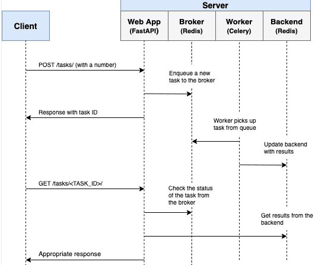

# FastAPI Celery

If a long-running process is part of your application's workflow, rather than blocking the response, you should handle it in the background, outside the normal request/response flow.

Perhaps your web application requires users to submit a thumbnail (which will probably need to be re-sized) and confirm their email when they register. If your application processed the image and sent a confirmation email directly in the request handler, then the end user would have to wait unnecessarily for them both to finish processing before the page loads or updates. Instead, you'll want to pass these processes off to a task queue and let a separate worker process deal with it, so you can immediately send a response back to the client. The end user can then do other things on the client-side while the processing takes place. Your application is also free to respond to requests from other users and clients.

To achieve this, we'll walk you through the process of setting up and configuring Celery and Redis for handling long-running processes in a FastAPI app. We'll also use Docker and Docker Compose to tie everything together. Finally, we'll look at how to test the Celery tasks with unit and integration tests.


----------


### Objectives:

1. Integrate Celery into a FastAPI app and create tasks.
2. Containerize FastAPi, Celery, and Redis with Docker.
3. Run processes in the background with a separate worker process
4. Save Celery logs to a file.
5. Set up `Flower` to monitor and administrator Celery jobs and workers
6. Test a Celery task with both unit and integeration tests.


----------


### Background Tasks

Again, to improve user experience, long-running process should be run outside the normal HTTP request/response flow, in a background process.

Examples:

    1. Running machine learning models
    2. Sending confirmation emails'
    3. Web scrapping and crawling
    4. Analyzing and data
    5. Processing images
    6. Generating reports

As you're building out an app, try to distinguish tasks that should run during the request/response lifecycle, like CRUG operations, from those that should run in the background.

It's worth noting that you can leverage FastAPI's `BackgroundTasks` class, which comes directly from `Starlette`, to run tasks in the background.

For example:

```py
from fastapi import BackgroundTasks


def send_email(email, message):
    pass


@app.get("/")
async def ping(background_tasks: BackgroundTasks):
    background_tasks.add_task(send_email, "email@address.com", "Hi!")
    return {"message": "pong!"}
```

So, when should you use Celery instead of `BackgroundTasks`?

1. **CPU intensive tasks**: Celery should be used for tasks that perform heavy background computations since `BackgroundTasks` runs in the same event loop that serves the app's requests.

2. **Task queue**: If you require a task queue to manage the tasks and workers you should use celery. Often you'll want to retreive the status of a job and then perform some action based on the status -- e.g., send an error email, kick off a different background task, or retry the task. Celery manages all this for you.

----------

### Workflow

Our goal is to develop a FastAPI application that works in conjunction with Celery to handle long-running process outside the normal request/response cycle.

1. The end user kicks off a new task via a POST request to the server-side.
2. Within the route handler, a task is added to the queue and task ID is sent back to the client-side.
3. Using AJAX, the client continues to poll the server the check the status of the task while the task itself is running in the background.



